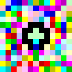
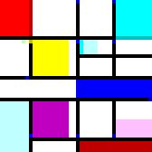
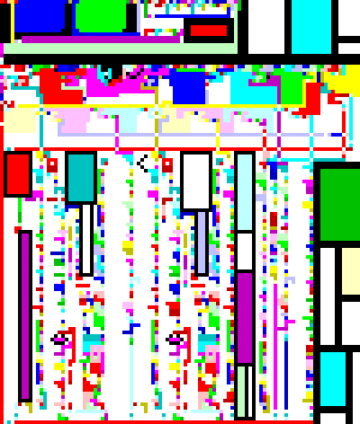

## Interpiet

A minimal interpreter for the esoteric programming language Piet written from scratch, in C.

---

### Piet

Piet is a stack based language designed by David Morgan-Mar, in which programs are bitmaps that look like abstract art. Named after Piet Mondrian. 
[Here](https://www.dangermouse.net/esoteric/piet.html) is the official spec sheet.

Checkout what more creative people than me have been able to make with Piet.

<div align="center">

  <br>
  <i>A very cool "Hello World" program</i><br><br><br>

  <br>
  <i>This program prints "Piet"</i><br><br><br>

  <br>
  <i>This is an entire interpreter for another esoteric language, Brainf*ck</i>

</div>

Piet is turing complete, even though it is as unwieldy as it gets.

### The interpreter

Written in C, very minimal thanks to how few instructions there are in Piet. It just has five moving parts.

1. Image loading: takes a ppm image with whatever bloat it might come with and loads it into memory after cleanup.
2. Downsampling: Adjust for codel size. 
3. Mapping: Uses BFS to define all the colorblock and edges in the program. A traditional language would call all these steps tokenizing.
4. Direction calculations: Exactly as it sounds. Decides the direction of program execution.
5. Execution: Translates the color transitions into operations and execute them on the stack.

### Usage

1. Compile with make

```bash
make
```
2. And run! There are a few sample ppm files in the directory. They all have `codel-size = 1` so ignore that flag. `-v` if you want block and step info.

```bash
./pietvm [-v] <image.ppm> [codel_size]
```

### TODO

1. Approximate color matching rather than demanding exacts.
2. png-to-ppm converter builtin
